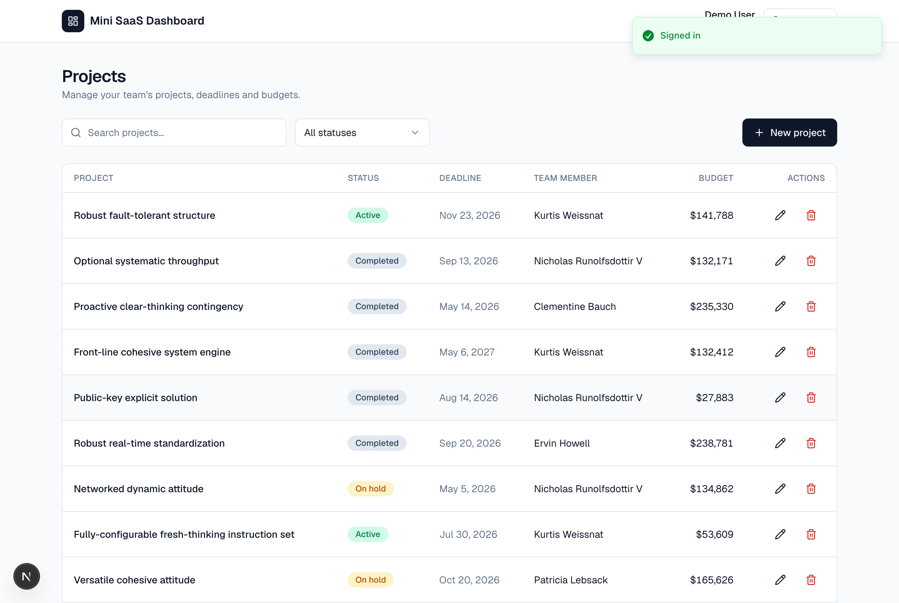
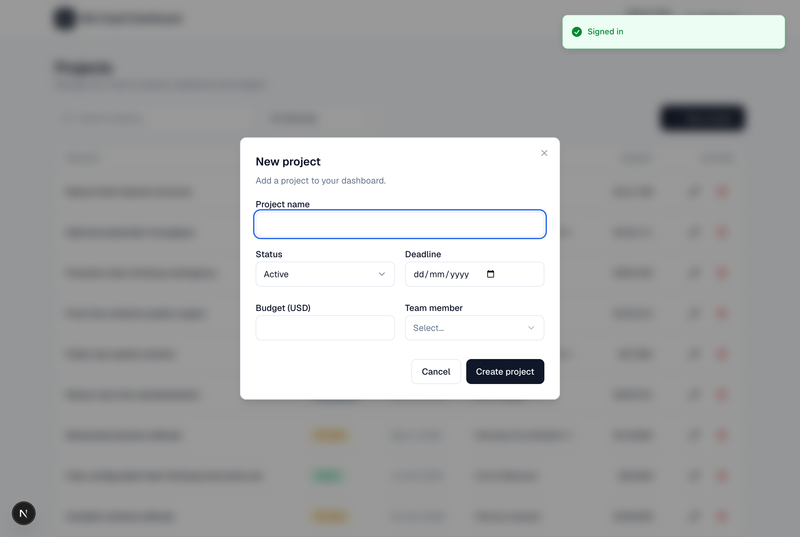
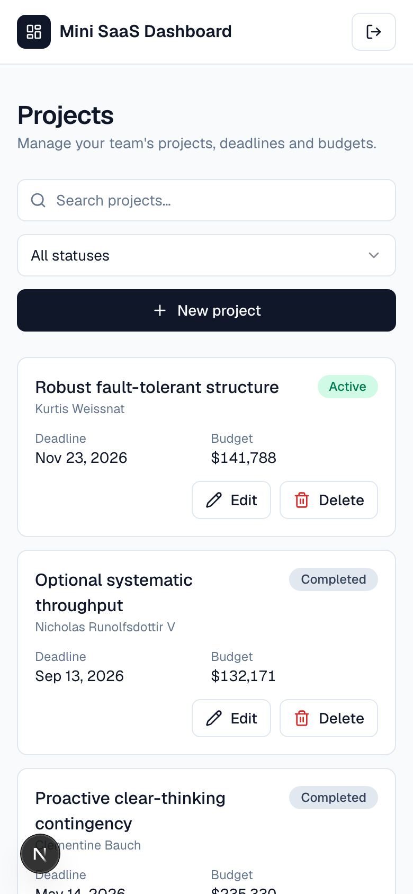

# Mini SaaS Dashboard

A small but production-shaped full-stack dashboard to **list, filter, search, add and edit projects**. Each project tracks a **status**, **deadline**, **assigned team member** and **budget**.

Built with Next.js (App Router), TypeScript, Tailwind CSS, Prisma and PostgreSQL, with JWT authentication, a REST API, a seeded database, tests, Docker and CI.



<p align="center">
  
  
</p>

---

## Features

- 🔐 **Authentication** — register / login / logout with bcrypt-hashed passwords and JWTs in an httpOnly cookie. Routes are guarded by edge middleware.
- 📋 **Projects table** — responsive (a real table on desktop, cards on mobile) with status badges and formatted dates/budgets.
- 🔎 **Filter & search** — filter by status and search by name, both server-side via query params.
- ➕ **Add / edit modal** — a single accessible modal form with shared client/server validation.
- 🗑️ **Delete** — with a confirmation dialog.
- 👤 **Per-user data** — every project is owned by the signed-in user; the API enforces ownership.
- 🌱 **Seeding** — team members pulled from the [JSONPlaceholder](https://jsonplaceholder.typicode.com/) public API, plus a demo user and 25 sample projects.
- ✅ **Tested** — Vitest unit/integration tests for schemas, the API and a component.
- 🐳 **Dockerised** + **GitHub Actions CI**.

## Tech stack

| Layer | Choice |
| --- | --- |
| Framework | Next.js 16 (App Router) + React 19 + TypeScript |
| Styling | Tailwind CSS v4, Radix UI primitives, lucide-react |
| Data | PostgreSQL + Prisma 7 (driver adapter `@prisma/adapter-pg`) |
| API | REST via Next.js Route Handlers |
| Auth | `jose` (JWT) + `bcryptjs`, httpOnly cookie, edge proxy guard |
| Validation | Zod (shared between client forms and the API) |
| Client state | TanStack Query, React Hook Form, Sonner toasts |
| Tests | Vitest + Testing Library |
| Tooling | Docker Compose, GitHub Actions |

## Architecture notes

- **Single source of validation.** The Zod schemas in [`lib/validations.ts`](lib/validations.ts) are used by both the React Hook Form modal and the API route handlers — there is no duplicated validation logic.
- **Edge / Node split.** [`proxy.ts`](proxy.ts) runs on the Edge runtime and only does an optimistic JWT check (`jose`, Web Crypto). Password hashing (`bcryptjs`) and database access stay in Node-runtime route handlers, which re-verify the session through a server-only DAL ([`lib/dal.ts`](lib/dal.ts)).
- **Ownership.** Projects are scoped by `ownerId`; reads/writes that don't belong to the current user return `404`.
- **Next.js 16.** Middleware is now [`proxy.ts`](proxy.ts), dynamic route `params` and `cookies()` are async — the code reflects these conventions.

---

## Getting started

### Prerequisites

- Node.js 20+ (developed on 24)
- One of: Docker, **or** a local PostgreSQL instance

### Option A — Docker (one command)

Brings up PostgreSQL and the app, runs migrations and seeds automatically:

```bash
docker compose up --build
```

App: <http://localhost:3000> · sign in with the demo credentials below.

### Option B — Local development

```bash
# 1. Install dependencies (also generates the Prisma client)
npm install

# 2. Configure environment
cp .env.example .env
#   then set DATABASE_URL and JWT_SECRET in .env
#   generate a secret with: openssl rand -base64 32

# 3. Create the schema and seed data
npm run db:migrate     # applies migrations
npm run db:seed        # team members + demo user + 25 projects

# 4. Run
npm run dev            # http://localhost:3000
```

### Demo credentials

```
email:    demo@dimovtax.com
password: password123
```

---

## Environment variables

| Variable | Description |
| --- | --- |
| `DATABASE_URL` | PostgreSQL connection string used by Prisma. |
| `JWT_SECRET` | Secret used to sign session JWTs (`openssl rand -base64 32`). |

See [`.env.example`](.env.example).

## npm scripts

| Script | Description |
| --- | --- |
| `dev` / `build` / `start` | Next.js dev / production build / serve |
| `lint` / `typecheck` | ESLint / `tsc --noEmit` |
| `test` / `test:watch` | Vitest |
| `db:migrate` | `prisma migrate dev` |
| `db:deploy` | `prisma migrate deploy` (production) |
| `db:seed` | Seed the database |
| `db:reset` | Reset + re-seed |
| `db:studio` | Open Prisma Studio |

---

## API reference

All `/api/projects*` and `/api/team-members` endpoints require the session cookie and return `401` otherwise. Project endpoints are scoped to the authenticated user.

### Auth

| Method | Endpoint | Body | Notes |
| --- | --- | --- | --- |
| `POST` | `/api/auth/register` | `{ name, email, password }` | Creates a user, sets the cookie. `409` if email taken. |
| `POST` | `/api/auth/login` | `{ email, password }` | `401` on bad credentials. |
| `POST` | `/api/auth/logout` | — | Clears the cookie. |
| `GET` | `/api/auth/me` | — | Current user or `401`. |

### Projects

| Method | Endpoint | Notes |
| --- | --- | --- |
| `GET` | `/api/projects?status=&q=&sort=` | List. `status` ∈ `ACTIVE\|ON_HOLD\|COMPLETED`; `q` searches the name; `sort` ∈ `name\|budget\|deadline`. |
| `POST` | `/api/projects` | Create. Body validated by Zod (`400` with field errors). |
| `GET` | `/api/projects/:id` | Read one (owned). |
| `PUT` | `/api/projects/:id` | Update (owned). |
| `DELETE` | `/api/projects/:id` | Delete (owned). |
| `GET` | `/api/team-members` | Assignable team members. |

**Project payload**

```json
{
  "name": "Apollo",
  "status": "ACTIVE",
  "deadline": "2026-12-01",
  "budget": 12000.5,
  "teamMemberId": "<team-member-id>"
}
```

**Example**

```bash
# login (store cookie)
curl -c cookies.txt -X POST http://localhost:3000/api/auth/login \
  -H 'Content-Type: application/json' \
  -d '{"email":"demo@dimovtax.com","password":"password123"}'

# list active projects
curl -b cookies.txt 'http://localhost:3000/api/projects?status=ACTIVE'
```

---

## Data model

```
User (1) ──< Project >── (1) TeamMember
```

- **User** — `id`, `email` (unique), `name`, `password` (bcrypt hash).
- **TeamMember** — `id`, `name`, `email` (seeded from JSONPlaceholder).
- **Project** — `id`, `name`, `status` (enum), `deadline`, `budget` (`Decimal(12,2)`), `ownerId` → User, `teamMemberId` → TeamMember, timestamps.

See [`prisma/schema.prisma`](prisma/schema.prisma).

## Testing

```bash
npm test
```

Covers the Zod schemas, the projects route handler (auth gating, ownership scoping, validation errors via mocked `db`/`dal`) and the `ProjectTable` component.

## Deployment

The app deploys to **Vercel** with any managed Postgres (Neon, Railway, Supabase):

1. Create a managed PostgreSQL database and copy its connection string.
2. Import the repo into Vercel; set `DATABASE_URL` and `JWT_SECRET` env vars.
3. Add `prisma migrate deploy` to the build (or run it once against the managed DB), then optionally `npm run db:seed`.

The `Dockerfile` / `docker-compose.yml` also make it portable to any container host.

## Project structure

```
app/
  (auth)/login, (auth)/register     # auth pages
  api/auth/*, api/projects/*, api/team-members   # REST handlers
  page.tsx                          # dashboard (protected)
components/        ui/ + table, modal, filters, header
lib/              db, session, dal, validations, queries, api-client, utils
prisma/           schema.prisma, migrations, seed.ts
proxy.ts          edge auth guard
```
